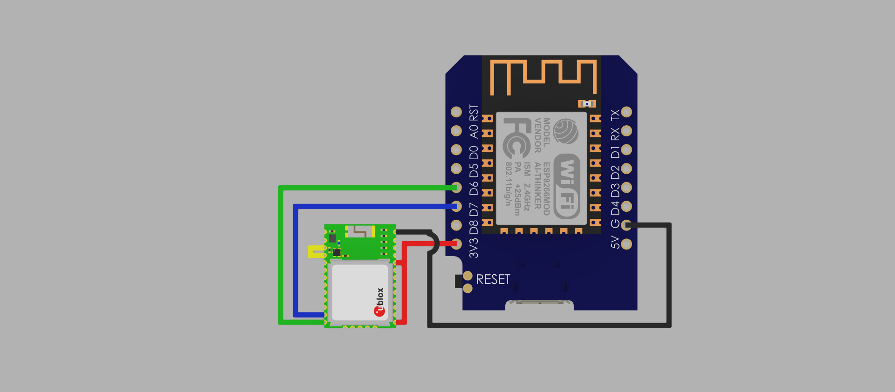
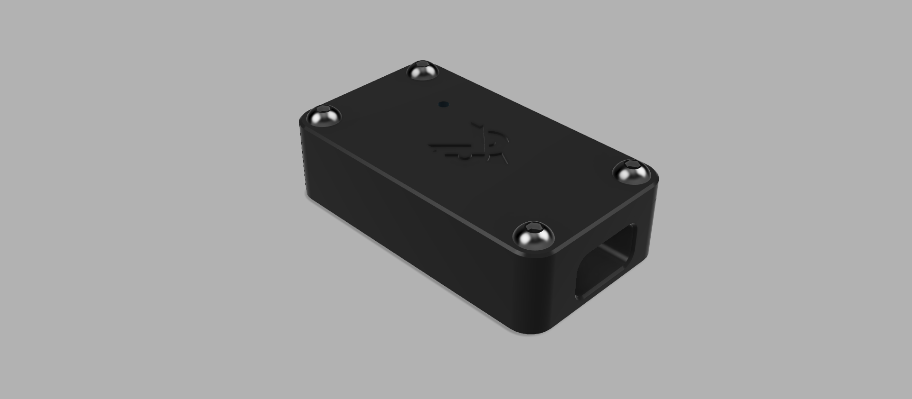
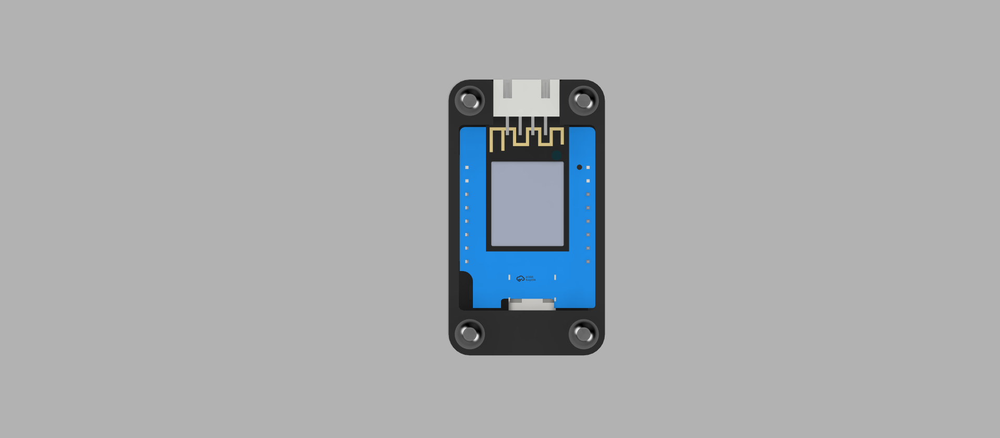
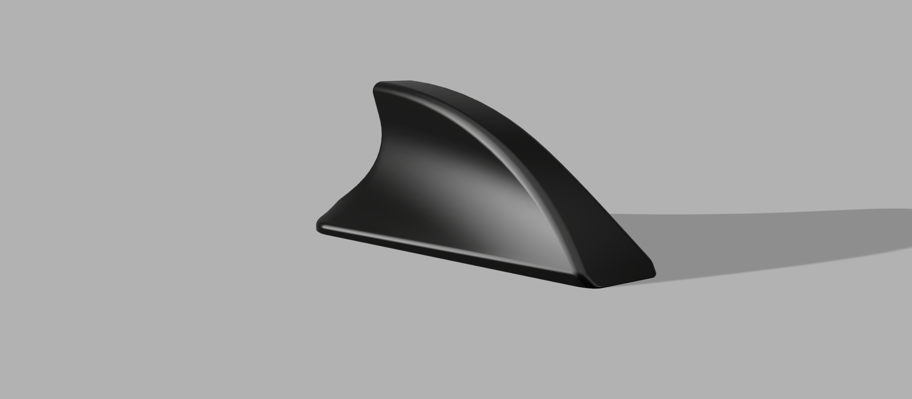
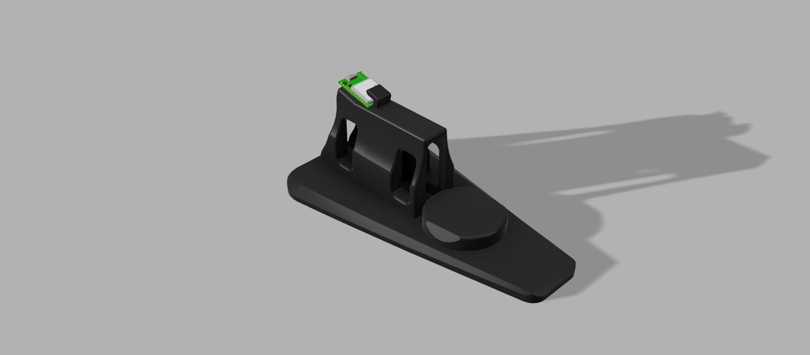

## Now Open Source — ESP8266 GPS UDP Tracker v1.1  

The full firmware and web interface are now open for everyone to use and modify!  

[**Download the latest release**](https://github.com/sc0ps/ESP8266-GPS-UDP-tracker/releases/latest)  
[**Read the Build & Flash Guide**](docs/How_to_Build_and_Flash_v1.1.md)

---

A compact ESP8266-based GPS-to-UDP tracker that transmits live GPS coordinates over WiFi.  
Ideal for DIY tracking, telemetry, and integration with PC or mobile map applications.

---

## Features

- **Web-based configuration portal**  
  Configure WiFi SSID, password, UDP address, port, and GPIO pins directly from your browser.
- **Automatic Access Point setup on first boot**  
  Starts its own WiFi network for easy configuration.
- **Live GPS data broadcast via UDP**
- **Status LED indicators**  
  Visual feedback for WiFi and GPS connection status.
- **Factory Reset via web interface**  
  Restore all configuration settings to default with a single click.
- **Open-source release (v1.1)**  
  Source code included under a CC BY-NC 4.0 license.

---

## Quick Start Guide

1. Download or clone this repository.  
2. Build the project with **PlatformIO**.  
3. Flash the firmware to your ESP8266 (e.g. Wemos D1 Mini or NodeMCU).  
4. On first boot, the device creates its own WiFi access point:  
   - SSID: `gps_tracker_setup`  
   - Password: `12345678`
5. Connect and open your browser at **http://192.168.4.1**.  
6. Enter your WiFi credentials, UDP settings, and (optional) GPIO pins for RX, TX, and LED.  
7. Save and restart — the ESP will reconnect automatically.  
8. GPS data will then be transmitted via UDP every second.

For developers: see the [How to Build and Flash Guide (v1.1)](docs/How_to_Build_and_Flash_v1.1.md)

---

## Hardware Setup

| Component      | Connection | ESP8266 Pin (Default) |
|----------------|-------------|------------------------|
| GPS Module TX  | →           | D7 (RX)                |
| GPS Module RX  | →           | D6 (TX)                |
| Status LED     | →           | D4                     |
| Power (VCC/GND)| →           | 3.3V / GND             |

> GPIO pins for RX, TX, and LED can be customized from the web interface.

  

---

## UDP Configuration

You can choose any valid UDP broadcast address and port depending on your network.

**Example:**
- For network `192.168.0.x` → use broadcast address `192.168.0.255`
- Default UDP Port: `5050`

---

## Data Format

The tracker sends GPS data as a comma-separated NMEA string via UDP:  
`$GPGGA,<latitude>,<longitude>,<altitude>,<time>,<satellites>`

This format is compatible with most mapping and telemetry software that supports UDP input.

---

## 3D Printed Case and Hardware Mount

A dedicated 3D-printed enclosure and shark-fin antenna system has been designed for this project,  
fitting the Wemos D1 Mini (ESP8266) and the u-blox CAM-M8Q GPS module.

### Cases on Printables

- **Wemos D1 Mini ESP8266 Case (USB-C + JST-XH Connector)**  
  [View on Printables](https://www.printables.com/model/1437053-wemos-d1-mini-esp8266-case-met-usb-c-en-4-pins-jst)

- **u-blox CAM-M8Q Shark-Fin Antenna Case (with Magnet Mount)**  
  [View on Printables](https://www.printables.com/model/1437877-u-blox-cam-m8q-shark-fin-antenna-case-with-magnet)

The cases feature:
- Secure fit for Wemos D1 Mini and CAM-M8Q  
- Magnetic base option for vehicle mounting  
- USB-C connector and JST-XH 4-pin quick connection  
- Compact, functional design — easy to print without supports  

  
  
  
  

---

## Integration with SondeAutoRX and ChaseMapper

The ESP8266 GPS UDP Tracker works seamlessly with **SondeAutoRX** and **ChaseMapper**,  
providing live GPS position updates to your Raspberry Pi-based tracking setup.

Full setup and configuration guide:  
[UDP Integration with SondeAutoRX and ChaseMapper](docs/UDP_Integration_with_SondeAutoRX_and_ChaseMapper.md)

Quick overview:
- Set your **UDP broadcast address** and **port (5050)** in the web interface  
- gpsd on the Pi listens for the UDP data and provides live GPS position to AutoRX and ChaseMapper  
- Works out of the box for live chase-car tracking

---

## Example Integration Setup

| Device | Function | Notes |
|---------|-----------|-------|
| ESP8266 GPS Tracker | Sends NMEA data via UDP | Connects to WiFi hotspot or Raspberry Pi |
| Raspberry Pi (AutoRX + ChaseMapper) | Receives GPS via gpsd | Runs tracking and mapping |
| GPS Module (u-blox CAM-M8Q) | Provides live coordinates | Mounted in shark-fin antenna case |

---

## Developer Resources

- [How to Build and Flash (v1.1)](docs/How_to_Build_and_Flash_v1.1.md)
- [UDP Integration with SondeAutoRX and ChaseMapper](docs/UDP_Integration_with_SondeAutoRX_and_ChaseMapper.md)
- [UBlox CAM-M8Q to Wemos D1 Mini Wiring Guide](docs/UBlox_CAM-M8Q_to_Wemos_D1_Mini.md)
- [Changelog](CHANGELOG.md)

---

## Supported Devices

- Wemos D1 Mini  
- NodeMCU v2/v3  
- Other ESP8266 boards with at least 4MB flash

---

## Disclaimer

This firmware is provided as-is, without any warranty.  
Use only with supported ESP8266 hardware and at your own risk.  
The author is not responsible for damage or data loss caused by improper use.

---

## License and Source Code

This project is licensed under the **GNU General Public License v3.0 (GPLv3)**.  
You may freely use, modify, and share this code as long as:
- The source remains open under the same license.
- Proper credit is given to **Scops Owl Designs (Sc0ps)**.
- Commercial redistribution complies with GPLv3 terms.

📄 Full license text: [LICENSE.md](./LICENSE.md)

---

## Author

**Scops Owl Designs (Sc0ps)**  
GitHub: [https://github.com/sc0ps/ESP8266-GPS-UDP-tracker](https://github.com/sc0ps/ESP8266-GPS-UDP-tracker)  
Email: [ScopsOwlDesigns@gmail.com](mailto:ScopsOwlDesigns@gmail.com)

---

© 2025 Scops Owl Designs (Sc0ps)  
Licensed under the [GNU General Public License v3.0](./LICENSE.md).  
You are free to use, modify, and distribute this software under the same license.  
For details, see the full license text in the repository.

