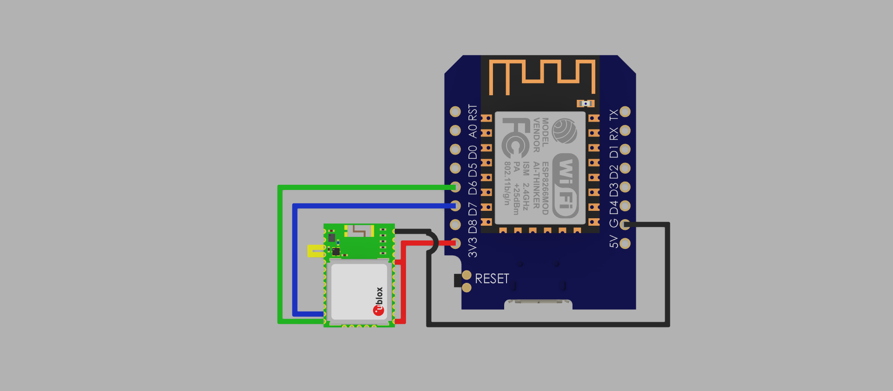

# ESP8266 GPS UDP Tracker v1.0

[](#) 
[](#) 
[](#)

A compact ESP8266-based GPS-to-UDP tracker that transmits live GPS coordinates over WiFi.  
Ideal for DIY tracking, telemetry, and integration with PC or mobile map applications.

---

## Features

- **Web-based configuration portal**  
  Configure WiFi SSID, password, UDP address, and port from your browser.
- **Automatic Access Point setup on first boot**  
  Starts its own WiFi network for easy configuration.
- **Live GPS data broadcast via UDP**
- **Status LED indicators**  
  Visual feedback for WiFi and GPS connection status.

---

## Quick Start Guide

1. Download the latest firmware: [gps_udp_tracker_v1.0.bin](./firmware/gps_udp_tracker_v1.0.bin)
2. Flash the provided `gps_udp_tracker_v1.0.bin` file to your ESP8266 (e.g. Wemos D1 Mini or NodeMCU).
3. On first boot, the device creates its own WiFi access point:  
   - SSID: `gps_tracker_setup`  
   - Password: `12345678`
4. Connect to it and open your browser at:  
   **http://192.168.4.1**
5. Enter your WiFi credentials and UDP settings.
6. Save and restart — the ESP will automatically reconnect to your WiFi whenever available.
7. GPS data will then be transmitted via UDP every second.

---

## Hardware Setup

| Component      | Connection | ESP8266 Pin |
|----------------|-------------|--------------|
| GPS Module TX  | →           | D7 (RX)      |
| GPS Module RX  | →           | D6 (TX)      |
| Status LED     | →           | D4           |
| Power (VCC/GND)| →           | 3.3V / GND   |

---

## UDP Configuration

You can choose any valid UDP broadcast address and port depending on your network.

**Example:**
- For network `192.168.0.x` → use broadcast address `192.168.0.255`
- Default UDP Port: `5050`

---

## Data Format

The tracker sends GPS data as a comma-separated string via UDP:  
```BASH $GPGGA,<latitude>,<longitude>,<altitude>,<time>,<satellites>
```

This format is compatible with most mapping and telemetry software that supports UDP input.

---

## 3D Printed Case and Hardware Mount

A dedicated 3D-printed enclosure and shark-fin antenna has been designed for this project,  
fitting the Wemos D1 Mini (ESP8266) and u-blox CAM-M8Q GPS module.

View and download the case on Printables:  
[Wemos D1 Mini ESP8266 Case with USB-C and 4-pin JST Connector](https://www.printables.com/model/1437053-wemos-d1-mini-esp8266-case-met-usb-c-en-4-pins-jst)

The case features:
- Secure fit for Wemos D1 Mini  
- USB-C connector for power  
- JST 4-pin connector for quick wiring  

  


The shark-fin antenna version will be published soon on Printables.

---

## Integration with SondeAutoRX and ChaseMapper

The ESP8266 GPS UDP Tracker is designed to work seamlessly with SondeAutoRX and ChaseMapper,  
providing live position updates to your Raspberry Pi-based sonde tracking setup.

Full setup and configuration guide:  
[See UDP Integration with SondeAutoRX and ChaseMapper](./docs/UDP_Integration_with_SondeAutoRX_and_ChaseMapper.md)

Quick overview:
- Set your Raspberry Pi IP and UDP port in the web interface  
- Configure ChaseMapper to receive NMEA data via UDP  
- Works with AutoRX and ChaseMapper for real-time chase tracking

---

## Example Integration Setup

| Device | Function | Notes |
|---------|-----------|-------|
| ESP8266 GPS Tracker | Sends NMEA data via UDP | Connects to WiFi hotspot or Pi |
| Raspberry Pi (AutoRX + ChaseMapper) | Receives GPS over UDP | Runs tracking and mapping |
| GPS Module (u-blox CAM-M8Q) | Provides live coordinates | Mounted in shark-fin antenna case |



---

## Firmware Version History

| Version | Changes |
|----------|----------|
| v1.0 | Initial release with web configuration, UDP broadcast, and LED status system. |

---

## Supported Devices

- Wemos D1 Mini  
- NodeMCU v2/v3  
- Other ESP8266 boards with at least 4MB flash

---

## Disclaimer

This firmware is provided as-is, without any warranty.  
Use only with supported ESP8266 hardware and at your own risk.  
The author is not responsible for damage or data loss caused by improper use.

---

## License and Source Code

The source code is not public.  
You may:
- Flash and use the provided `.bin` firmware for personal or educational purposes.
- Share the compiled `.bin` file unmodified.

You may not:
- Redistribute modified versions of this firmware.
- Use it commercially or include it in other projects without written permission.

---

## Future Development

- Optional configuration of RX/TX and LED pins via web interface  
- Shark-fin GPS antenna version on Printables 
- UDP Integration with SondeAutoRX and ChaseMapper.dm  

---

## Author

Scops Owl Designs  
GitHub: [https://github.com/sc0ps/ESP8266-GPS-UDP-tracker](https://github.com/sc0ps/ESP8266-GPS-UDP-tracker)

---

© 2025 Scops Owl Designs  
All rights reserved.  
For license and usage terms, see [LICENSE](./LICENSE).