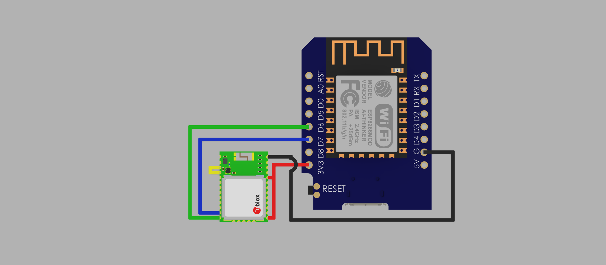

# Connecting a u-blox CAM-M8Q GPS Module to the Wemos D1 Mini (ESP8266)

This guide explains how to connect and power a **u-blox CAM-M8Q** GPS receiver to a **Wemos D1 Mini (ESP8266)** for use with the ESP8266 GPS UDP Tracker firmware.

---

## Overview

The **CAM-M8Q** is a compact GPS/GLONASS/Galileo/BeiDou receiver module from u-blox.  
When paired with the Wemos D1 Mini, it can provide accurate position data over UART (TX/RX).

**Important:** When using the internal patch antenna, you must connect **pin 16 (RF_OUT)** to **pin 17 (RF_IN)** on the CAM-M8Q module.

---

## Hardware Connections

| CAM-M8Q Pin | Function          | Wemos D1 Mini Pin | Notes |
|--------------|------------------|--------------------|-------|
| 1            | VCC_IO           | 3.3V               | I/O voltage, must be 3.3V |
| 3            | VCC              | 3.3V               | Main power input |
| 13           | GND              | GND                | Common ground connection |
| 16           | RF_OUT           | —                  | Connect to pin 17 for internal antenna use |
| 17           | RF_IN            | —                  | Connect to pin 16 for internal antenna use |
| 25           | TX / SPI_MISO    | D7 (GPIO13)        | GPS → ESP8266 (data output) |
| 26           | RX / SPI_MOSI    | D6 (GPIO12)        | ESP8266 → GPS (optional configuration input) |

---

## Power Notes

- Both **VCC_IO** and **VCC** must be supplied with **3.3V** (from the Wemos D1 Mini).  
- **Do not power the module with 5V.** The CAM-M8Q is **not 5V tolerant**.
- Typical current draw is below 30mA, safe for the D1 Mini’s onboard 3.3V regulator.

---

## Antenna Configuration

- If your CAM-M8Q has a **built-in ceramic patch antenna**, connect **pin 16 (RF_OUT)** to **pin 17 (RF_IN)**.
- If you’re using an **external antenna**, leave these pins disconnected and connect your antenna to the RF connector instead.

---

## Serial Interface (UART)

The tracker firmware communicates with the CAM-M8Q over UART at **9600 baud** by default.

| Direction | Signal | From | To |
|------------|---------|------|----|
| GPS → ESP  | TX      | CAM-M8Q pin 25 | Wemos D1 Mini D7 |
| ESP → GPS  | RX      | Wemos D1 Mini D6 | CAM-M8Q pin 26 |

If you’re using custom pins or baud rate, these can be adjusted in the firmware configuration.

---

## Example Wiring Summary

'CAM-M8Q Pin 1 (VCC_IO) → Wemos 3.3V'
'CAM-M8Q Pin 3 (VCC) → Wemos 3.3V'
'CAM-M8Q Pin 13 (GND) → Wemos GND'
'CAM-M8Q Pin 25 (TX) → Wemos D7 (RX)'
'CAM-M8Q Pin 26 (RX) → Wemos D6 (TX)'
'CAM-M8Q Pin 16 (RF_OUT) → CAM-M8Q Pin 17 (RF_IN)'

---

## Safety & Recommendations

- Double-check all **power and ground connections** before powering on.  
- Ensure **no 5V** is applied to the CAM-M8Q.  
- Keep UART cable lengths short to minimize noise.  
- For optimal GPS performance, place the module with a **clear view of the sky**.

---

## Compatible Firmware

This wiring is designed for:
- **ESP8266 GPS UDP Tracker v1.0**
- Any project using SoftwareSerial (D7/D6) for NMEA data reception at 9600 baud.

---

## Example Diagram

---

**Scops Owl Designs – 2025**

